<div align="center">



<br/>

<a href="https://linkedin.com/in/serkanncakmak"></a>
<a href="https://stackoverflow.com/users/20825947/serkan"></a>
<a href="https://kaggle.com/serkanakmak"></a>
<a href="https://www.hackerrank.com/sekyouone"></a>
<a href="https://leetcode.com/seko7"></a>


</div>

<br/>

<div align="center">
  
  <br/>
  
</div>

<br/>

<div align="center">
  
  <br/>
  
</div>

<br/>

<div align="center">
  
  <br/>
  
</div>

<br/>

<div align="center">
  
  <br/>
  
  <br/>
  <sub>🟪 Backend &nbsp;·&nbsp; 🟥 Frontend &nbsp;·&nbsp; 🟦 Database &nbsp;·&nbsp; 🟩 DevOps &amp; Tools</sub>
</div>

<br/>

<div align="center">
  
</div>

```text
 [x] Build enterprise applications with .NET & Angular
 [x] Craft RESTful APIs with Python & Django
 [x] Master relational databases
 [~] Dive deeper into software architecture      (IN PROGRESS)
 [~] Optimize everything, always                 (IN PROGRESS)
 [ ] Unlock: Open Source Contributor badge       (LOCKED)
 [ ] Defeat the final boss: Legacy Code          (LOCKED)
```

<br/>

<div align="center">
  
  <br/>
  
  
  <br/>
  
</div>

<div align="center">
  
</div>

<br/>

<div align="center">
  

| 🎮 ARCADE | 🪪 PLAYER TAG | 🔗 |
|:---------:|:-------------:|:--:|
| **Stack Overflow** | `serkan` | [JOIN →](https://stackoverflow.com/users/20825947/serkan) |
| **LeetCode** | `seko7` | [JOIN →](https://leetcode.com/seko7) |
| **HackerRank** | `sekyouone` | [JOIN →](https://www.hackerrank.com/sekyouone) |
| **Kaggle** | `serkanakmak` | [JOIN →](https://kaggle.com/serkanakmak) |
| **LinkedIn** | `serkanncakmak` | [JOIN →](https://linkedin.com/in/serkanncakmak) |

</div>

<br/>

<div align="center">
  <a href="https://linkedin.com/in/serkanncakmak">
    
  </a>
</div>
